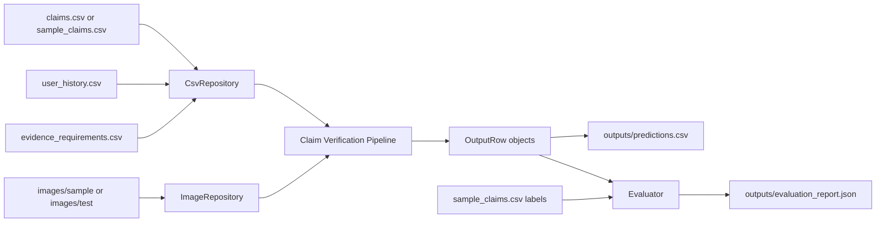
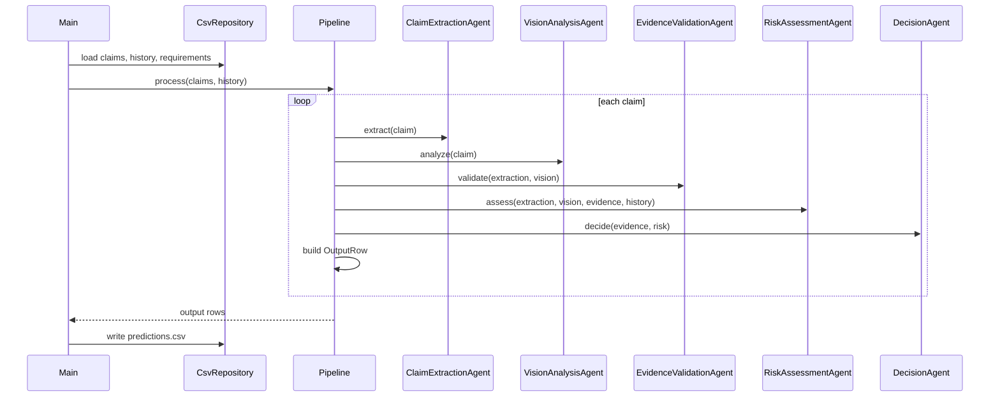
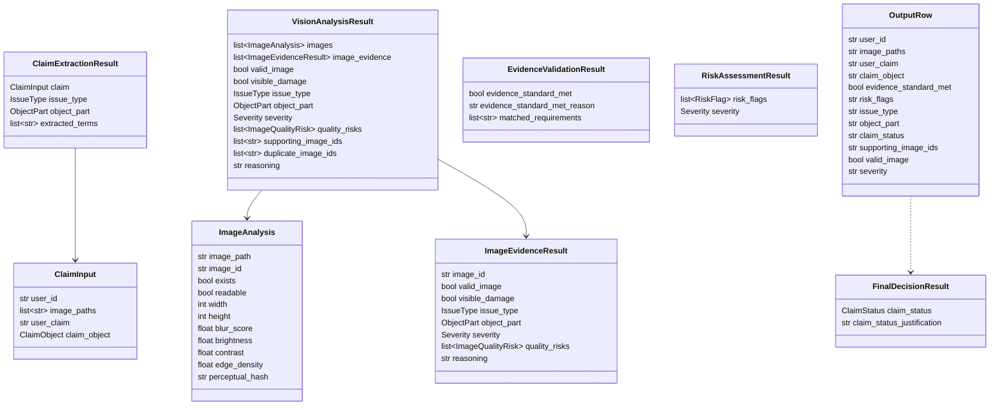

# Multi-Modal Damage Claim Verification System Architecture

## 1. Problem Definition

Insurance, warranty, and logistics teams need a repeatable way to verify whether a submitted damage claim is supported by the available evidence. The system ingests structured claim data, user history, evidence requirements, and image paths, then produces a normalized decision row for each claim.

The target claim objects are:

- `car`
- `laptop`
- `package`

The system must avoid hardcoded claim outcomes. Decisions are derived from claim text, configured evidence requirements, user-history signals, image availability, image quality metrics, and deterministic risk rules.

## 2. Functional Requirements

- Read `claims.csv`, `sample_claims.csv`, `user_history.csv`, and `evidence_requirements.csv`.
- Process image paths under `images/sample` and `images/test`.
- Parse claim text into candidate `issue_type` and `object_part`.
- Analyze one or more images per claim.
- Detect image validity, quality risks, visible damage signals, likely issue type, likely object part, severity, and supporting image IDs.
- Validate submitted evidence against evidence standards.
- Assess user-history and evidence risk flags.
- Produce final claim status and justification.
- Write output with the exact required schema and column order.
- Evaluate predictions against `sample_claims.csv` when labels are available.

## 3. Non Functional Requirements

- Modular: each agent has one primary responsibility.
- Maintainable: domain models isolate business language from infrastructure details.
- Scalable: agents can be replaced independently, including future ML-backed vision models.
- Testable: pipeline components use dependency injection and typed interfaces.
- Observable: Loguru provides structured logs for processing, failures, and decisions.
- Deterministic: current implementation uses explainable rules and image metrics.
- Resilient: missing or unreadable images are handled as evidence failures, not runtime failures.
- Portable: runs locally through Python and can be packaged for containers or batch jobs.

## 4. Data Flow



## 5. Agent Responsibilities

### Claim Extraction Agent

- Normalizes claim text.
- Extracts candidate `issue_type`.
- Extracts candidate `object_part`.
- Produces `ClaimExtractionResult`.

### Vision Analysis Agent

- Resolves and analyzes every submitted image.
- Computes image quality metrics through OpenCV/Pillow.
- Detects quality risks:
  - `blurry_image`
  - `cropped_or_obstructed`
  - `low_light_or_glare`
  - `missing_image`
  - `unreadable_image`
- Infers image-grounded visible damage signals.
- Aggregates multi-image evidence.
- Returns `VisionAnalysisResult` with supporting image IDs and reasoning.

### Evidence Validation Agent

- Matches claim object, issue type, and object part to configured evidence requirements.
- Determines whether the evidence standard is met.
- Explains why evidence passes or fails.

### Risk Assessment Agent

- Adds risk flags from user history.
- Adds evidence and image risk flags.
- Detects duplicate images through perceptual hashes.
- Produces severity and risk flag list.

### Decision Agent

- Combines evidence and risk outputs.
- Produces final claim status:
  - `supported`
  - `needs_review`
  - `not_supported`
- Produces final decision justification.

## 6. Pipeline Flow



## 7. Class Diagram



## 8. Module Dependencies

```text
claim_verification.main
  -> config.settings
  -> infrastructure.csv_repository
  -> infrastructure.image_repository
  -> infrastructure.logger
  -> application.factory
  -> evaluation.evaluator

application.factory
  -> agents.*
  -> vision.image_features

application.pipeline
  -> agents.*
  -> domain.models

agents.*
  -> domain.models
  -> domain.enums
  -> domain.ports
  -> vision.image_features

infrastructure.*
  -> domain.models

vision.image_features
  -> domain.models
  -> OpenCV
  -> Pillow
  -> imagehash
```

Domain modules do not depend on infrastructure or application modules.

## 9. Risk Handling Strategy

Risk handling is layered:

- Evidence risk: missing images, unreadable images, weak image quality, insufficient evidence.
- User risk: previous rejected claims, high recent claim frequency, configured history flags.
- Image risk: duplicates, blur, low light, glare, cropped or obstructed content.
- Claim risk: ambiguous text or unspecified issue/part.

Risk flags do not automatically reject every claim. The Decision Agent distinguishes between:

- `not_supported`: evidence is unavailable or invalid.
- `needs_review`: evidence exists but risk indicators require human review.
- `supported`: evidence standard is met and no material risk flags exist.

## 10. Evaluation Strategy

The evaluation framework uses `sample_claims.csv` as labeled data when target columns are present.

Metrics:

- Exact-match accuracy across comparable target columns.
- Per-column accuracy for:
  - `evidence_standard_met`
  - `risk_flags`
  - `issue_type`
  - `object_part`
  - `claim_status`
  - `supporting_image_ids`
  - `valid_image`
  - `severity`
- Schema validity against the required output column order.

If labels are unavailable, the evaluator still reports row count and schema validity.

## 11. Cost and Runtime Analysis

Current implementation is CPU-only and deterministic.

Expected runtime drivers:

- Number of claim rows.
- Number of image paths per claim.
- Image dimensions.
- Perceptual hash computation.

Approximate complexity:

- CSV loading: `O(n)` rows.
- Claim text extraction: `O(n * p)` where `p` is number of text patterns.
- Image processing: `O(m * pixels)` where `m` is total image count.
- Risk and decision rules: `O(n)`.

Infrastructure cost:

- Local runtime: no external API cost.
- Container or batch deployment: CPU and storage only.
- Future ML vision model deployment would add GPU or API inference cost.

## 12. Deployment Considerations

Recommended deployment options:

- Local hackathon demo: run `python run.py`.
- Batch job: mount input CSV/image directory and write outputs to a shared volume.
- Container: package Python dependencies and run the CLI entrypoint.
- Scheduled production job: trigger when new claim batches arrive.

Operational considerations:

- Keep `outputs/` and `logs/` writable.
- Validate input CSV presence before running.
- Store images in stable project-relative or absolute paths.
- Keep evidence requirements configurable through CSV.
- Add model registry or remote inference adapter if replacing heuristics with trained vision models.
- Emit structured logs to a file sink or centralized logging platform.
- Version output schema changes explicitly because downstream consumers depend on exact columns.

